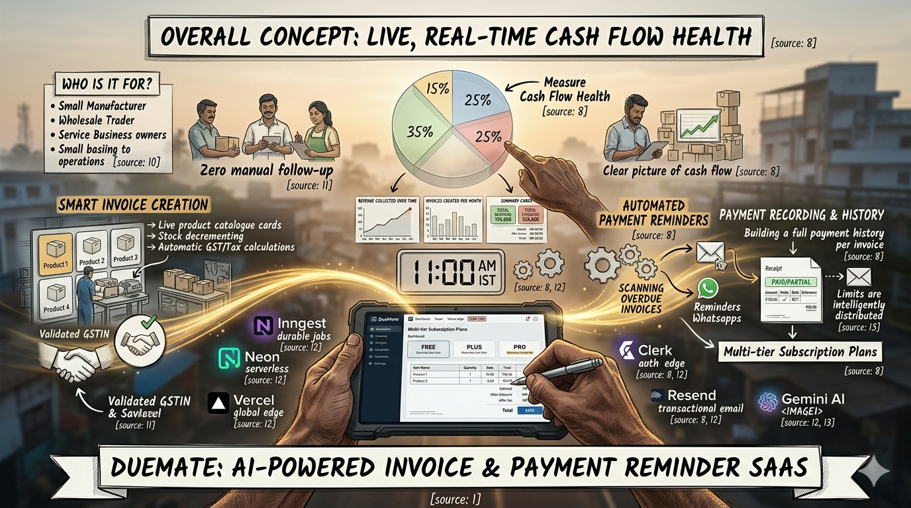

<div align="center">

# DueMate

### AI-Powered Invoice & Payment Reminder SaaS

**Get paid on time. Every time.**

[](https://nextjs.org)
[](https://www.typescriptlang.org)
[](https://tailwindcss.com)
[](https://neon.tech)
[](https://vercel.com)

</div>

---

## What is DueMate?

DueMate is an AI-powered invoicing and payment reminder SaaS built for small and medium businesses in India. It solves one of the most persistent problems in small business operations: **getting paid on time.**

Most small businesses — traders, wholesalers, manufacturers, freelancers — create invoices manually, track payments in notebooks or spreadsheets, and chase buyers through awkward phone calls. Reminders get forgotten. Payments get delayed. Cash flow suffers.

DueMate automates the entire payment collection cycle — from the moment an invoice is created to the day it's paid — so business owners **never have to manually chase a payment again.**

### The Core Idea

```
Create an invoice    → buyer gets notified instantly
Record a payment     → buyer gets a receipt automatically
Invoice goes overdue → buyer gets a daily reminder at 11 AM
                       without you lifting a finger
```

---

## Problems Solved

| Pain Point | How DueMate Fixes It |
|---|---|
| Chasing payments manually is awkward | Automated daily reminders sent at 11 AM IST — zero manual effort |
| Buyers forget invoices / miss due dates | Instant email on creation + escalating overdue reminders |
| Partial payments are hard to track | Full payment history per invoice with cash/online split |
| Retyping buyer details on every invoice | Save once, auto-fill forever from buyer dropdown |
| No visibility into stock levels or margins | Live inventory tracking with colour-coded stock badges |
| No idea how much is owed in total | Insights dashboard with charts, overdue totals, and AI summary |
| Wrong email = reminder never arrives | GSTIN + email validation enforced at buyer creation |
| Free tools lock everything behind paywalls | Fully functional free tier with transparent usage limits |

---

## Features

### 01 · Smart Invoice Creation
Create detailed invoices with line items, GST rates, discounts (flat or %), and taxes — all computed live. A full preview modal shows the final layout before saving. Stock decrements automatically on save.

### 02 · Automated Payment Reminders
Every day at 11:00 AM IST, a background job scans all invoices. Overdue invoices trigger consolidated reminder emails per buyer — without any manual action. Powered by Inngest (durable, crash-safe background jobs).

### 03 · Instant Email Notifications
Three professionally designed emails cover the full payment lifecycle:
- **Invoice Created** — Indigo-themed, with line items table and due date
- **Payment Confirmed** — Green-themed receipt with PAID/PARTIAL banner
- **Overdue Reminder** — Amber-themed, lists all outstanding invoices with days-overdue badges

### 04 · Payment Recording & History
Record partial or full payments inline. Track cash vs. online splits. Balance auto-updates; status flips to "Paid" when cleared. Every payment is logged with mode, date, reference, and notes.

### 05 · Buyer Management
Save buyer details (name, shop, email, phone, GSTIN) once and reuse across all invoices. GSTIN validated against Indian format. Edit inline at any time.

### 06 · Product Catalogue & Inventory
Maintain a product catalogue with selling rate, purchase rate, GST rate, and HSN code. Margin % calculated automatically. Stock badge colour-coded: Green / Amber (≤5) / Red (0).

### 07 · Supplier Management
Save supplier records once and auto-fill supplier details when adding products — no more retyping shop names, phones, or GSTINs.

### 08 · Business Insights & AI Summary
Visual analytics dashboard with revenue trends, invoice status distribution, and payment behaviour charts. Gemini-powered business health summary gives 2–3 sentence advisory on your cash flow.

### 09 · Smart Free Plan
Progress bars show used/limit for all resources. Lock cards explain caps and link to upgrade — nothing breaks silently. Email cap intelligently distributes 3 monthly slots per buyer: invoice notify → payment receipt → overdue reminder (always reserved).

### Coming Soon
- **AI Invoice Extraction** — Upload a bill image/PDF, Gemini reads line items automatically (Plus/Pro)
- **WhatsApp Reminders** — Meta WhatsApp Cloud API, no Twilio/BSP markup (Plus/Pro)
- **Zoho Books Sync** — OAuth 2.0 one-click invoice + contact sync (Pro)

---

## Tech Stack

### Frontend
| Technology | Purpose |
|---|---|
| **Next.js 16** | App Router, TypeScript, Turbopack |
| **Tailwind CSS v4** | `@import 'tailwindcss'` syntax, no config file |
| **Framer Motion** | Page and component animations |
| **GSAP + Lenis** | Feature slider sweeps, smooth scroll |
| **shadcn/ui** | Accessible pre-built components |
| **React Hook Form + Zod** | Type-safe form validation |

### Backend
| Technology | Purpose |
|---|---|
| **Next.js API Routes** | App Router serverless API |
| **Clerk v7** | Authentication + subscription billing |
| **Drizzle ORM** | Type-safe schema-first SQL |
| **Neon PostgreSQL** | Serverless database with connection pooling |

### AI & Automation
| Technology | Purpose |
|---|---|
| **Gemini 3.1 Flash-Lite** | Invoice data extraction + business health summary |
| **Inngest** | Durable background jobs — reminder scheduling & delivery |
| **Resend + React Email** | Transactional email with audit log |
| **Meta WhatsApp Cloud API** | Direct WhatsApp reminders (no Twilio) |

### Infrastructure
| Technology | Purpose |
|---|---|
| **Vercel** | Hosting + CI/CD |
| **ImageKit** | CDN + storage for invoice PDFs/images |
| **Cloudinary** | Video/image CDN for landing page assets |

---

## Database Schema

8 tables on Neon PostgreSQL:

```
users              — Clerk userId, plan (free/starter/pro), timezone
customers          — Buyers with GSTIN, email, lastEmailSentAt
suppliers          — Reusable supplier records for product auto-fill
products           — Catalogue with rate, stock, GST, HSN, margin
invoices           — Full invoice with line items, payment history (JSONB)
reminders          — Scheduled reminder records per invoice
reminder_settings  — Per-user timing toggles (30/14/7/3/1 day, overdue)
notifications      — Email audit log + free plan email cap enforcement
```

---

## Pricing

| Feature | Free | Plus · $9/mo | Pro · $29/mo |
|---|---|---|---|
| Invoices | 4 / month | 100 / month | Unlimited |
| Buyers | 10 total | 200 total | Unlimited |
| Products | 10 total | Unlimited | Unlimited |
| Emails per buyer | 3 / month | Unlimited | Unlimited |
| WhatsApp Reminders | — | ✓ | ✓ |
| AI Extraction | — | 50 / month | Unlimited |
| Zoho Books Sync | — | — | ✓ |
| Team Members | 1 | 1 | Up to 5 |

---

## Local Development

### Prerequisites
- Node.js 18+
- A `.env` file at project root (see Environment Variables below)

### Setup

```bash
# Install dependencies
npm install

# Push schema to Neon
npx drizzle-kit push

# Start development servers (run both in separate terminals)
npm run dev            # Next.js on port 3000
npx inngest-cli dev    # Inngest dev server on port 8288
```

### Other Commands

```bash
npx drizzle-kit studio  # Visual DB browser
npx tsc --noEmit        # Type-check without building
```

> **Note:** `INNGEST_DEV=1` must be set in `.env` locally. Do **not** set it on Vercel.

---

## Environment Variables

Add to `.env` at project root (never commit this file):

```env
# Clerk
NEXT_PUBLIC_CLERK_PUBLISHABLE_KEY=
CLERK_SECRET_KEY=
NEXT_PUBLIC_CLERK_SIGN_IN_URL=/sign-in
NEXT_PUBLIC_CLERK_SIGN_UP_URL=/sign-up
NEXT_PUBLIC_CLERK_AFTER_SIGN_IN_URL=/
NEXT_PUBLIC_CLERK_AFTER_SIGN_UP_URL=/

# Neon
DATABASE_URL=                    # pooled — used by app
DATABASE_URL_UNPOOLED=           # direct — for drizzle-kit push only

# Gemini
GEMINI_API_KEY=
GEMINI_MODEL=gemini-3.1-flash-lite-preview

# Resend
RESEND_API_KEY=
RESEND_FROM_EMAIL=
RESEND_FROM_NAME=

# Meta WhatsApp
META_WHATSAPP_ACCESS_TOKEN=
META_WHATSAPP_PHONE_NUMBER_ID=
META_WHATSAPP_BUSINESS_ACCOUNT_ID=
META_APP_ID=
META_APP_SECRET=
META_WEBHOOK_VERIFY_TOKEN=

# Inngest
INNGEST_EVENT_KEY=
INNGEST_SIGNING_KEY=
INNGEST_DEV=1                    # local only — remove on Vercel

# ImageKit
IMAGEKIT_PUBLIC_KEY=
IMAGEKIT_PRIVATE_KEY=
IMAGEKIT_URL_ENDPOINT=

# Zoho Books
ZOHO_CLIENT_ID=
ZOHO_CLIENT_SECRET=
ZOHO_REDIRECT_URI=
ZOHO_ORG_ID=

# App
NEXT_PUBLIC_APP_URL=
```

---

## Project Structure

```
src/
├── app/
│   ├── page.tsx                        # Landing page
│   ├── dashboard/page.tsx              # Main dashboard (all tabs)
│   ├── pricing/page.tsx                # Clerk PricingTable
│   ├── features/page.tsx              # Features marketing page
│   ├── how-it-works/page.tsx          # Product walkthrough page
│   └── api/
│       ├── customers/                  # GET, POST, PATCH
│       ├── products/                   # GET, POST, PATCH
│       ├── invoices/                   # GET, POST, PATCH
│       ├── suppliers/                  # GET, POST, PATCH
│       ├── analytics/ai-summary/       # Gemini health summary
│       └── inngest/                    # Inngest webhook handler
├── components/
│   ├── Navbar.tsx
│   ├── HeroSection.tsx
│   └── CustomCursor.tsx
├── emails/
│   ├── InvoiceCreatedEmail.tsx
│   ├── PaymentReceiptEmail.tsx
│   └── PaymentDueReminderEmail.tsx
├── inngest/
│   ├── client.ts
│   └── functions.ts                    # 3 background functions
└── lib/
    ├── schema.ts                       # Drizzle table schemas
    ├── db.ts                           # Neon HTTP driver
    └── auth.ts                         # getOrCreateUser()
```

---

## Deployment

DueMate deploys to **Vercel** automatically on push to `main`.

After deploying, register your Inngest endpoint in [Inngest Cloud](https://app.inngest.com):
```
Apps → Sync → https://your-domain.com/api/inngest
```

---

<div align="center">

Built with ♥ for small businesses that deserve to get paid on time.

</div>
